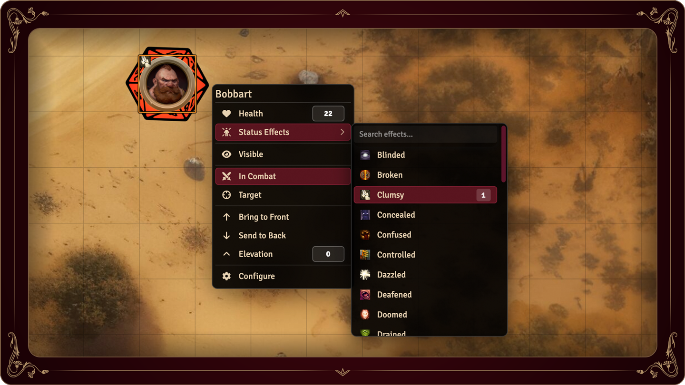

# token-hud-2e

Foundry VTT token HUD improvements for [foundryvtt/pf2e](https://github.com/foundryvtt/pf2e).


## Usage
### Applying Status Effects
Clicking the status effects item in the HUD's list will open a sub-menu where you can immediately begin searching for status effects to apply to the token.

- `Enter` applies/increments the selected condition from the list. If no condition is selected, the first condition in the list will be applied.
- `Shift+Enter` decrements the condition level.

## Known Issues

 - `Bring to Front/Send to Back` seems to increment/decrement the z-index of the token by 1 for each click, rather than send the token all the way to the front/back. Until fixed, be mindful of excessive clicking :)

 ## To-Do
 - Quick access to applied conditions in the main HUD for easy removal.
 - Health increment/decrement buttons with stops for 1/5/10 HP adjustments

 
 ## Installation
Paste the following manifest URL into Foundry's "Install Module" dialog:
    
 ```
 https://raw.githubusercontent.com/mattermill/token-hud-2e/refs/heads/main/module.json
 ```

## Screenshots

